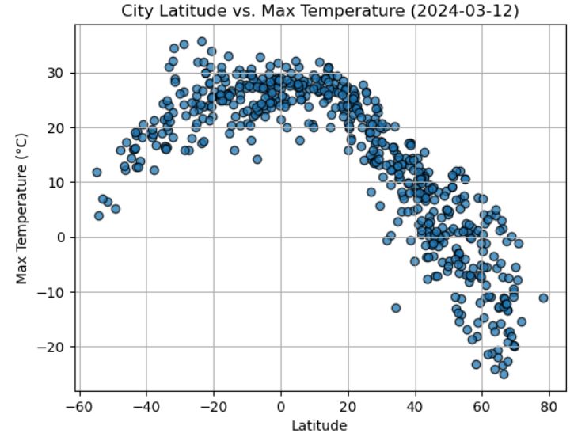
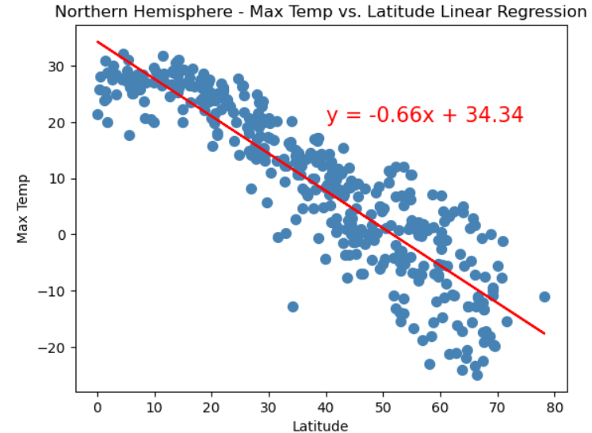
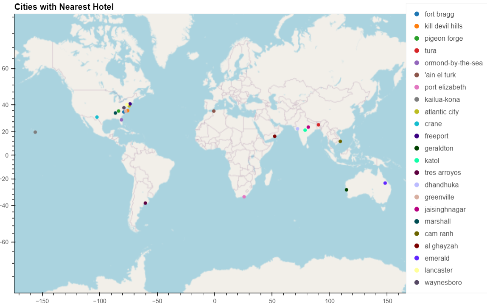

# Weather Analysis and Hotel Search

This project aims to analyze weather data from various cities around the world and find ideal locations for travelers based on specified weather conditions. It utilizes the OpenWeatherMap API to gather current weather data for the cities and the Geoapify API to find nearby hotels within a certain radius.

## Project Structure

The project consists of two main parts:

1. **Weather Analysis.ipynb:**
   - Retrieves weather data for a list of randomly generated cities using the OpenWeatherMap API.
   - Creates scatter plots to visualize the relationships between weather variables (temperature, humidity, cloudiness, and wind speed) and latitude.

   

   - Computes linear regression for each relationship to analyze trends.

   

   - Saves the output data and plots in CSV files and PNG images, respectively.

2. **Vacation.ipynb:**
   - Utilizes the weather data obtained in Part 1.
   - Finds hotels near cities that meet specified weather criteria using the Geoapify API.
   - Displays the cities on a map along with markers indicating the locations of the hotels found.

   

## Requirements

- Python 3.x
- Libraries: Matplotlib, Pandas, NumPy, Requests, SciPy, hvPlot, Citipy
- OpenWeatherMap API key
- Geoapify API key

## Installation

1. Clone the repository to your local machine:

   ```
   [git clone https://github.com/your_username/weather-analysis.git](https://github.com/NataliiaShevchenko620/World_Weather_Analysis.git)
   ```

2. Install the required Python libraries:

   ```
   pip install -r requirements.txt
   ```

3. Obtain API keys for OpenWeatherMap and Geoapify and save them in a file named `api_keys.py` in the project directory:

   ```python
   weather_api_key = "your_openweathermap_api_key"
   geoapify_key = "your_geoapify_api_key"
   ```

## Usage

1. Run Part 1 of the project to gather weather data and analyze relationships:

   ```
   python WeatherPy.solved.ipynb
   ```

2. Run Part 2 of the project to search for hotels near cities with ideal weather conditions:

   ```
   python VacationPy.solved.ipynb
   ```

3. View the generated plots and maps in the `output_data` directory.


## License

This project is licensed under the MIT License - see the [LICENSE](LICENSE) file for details.
